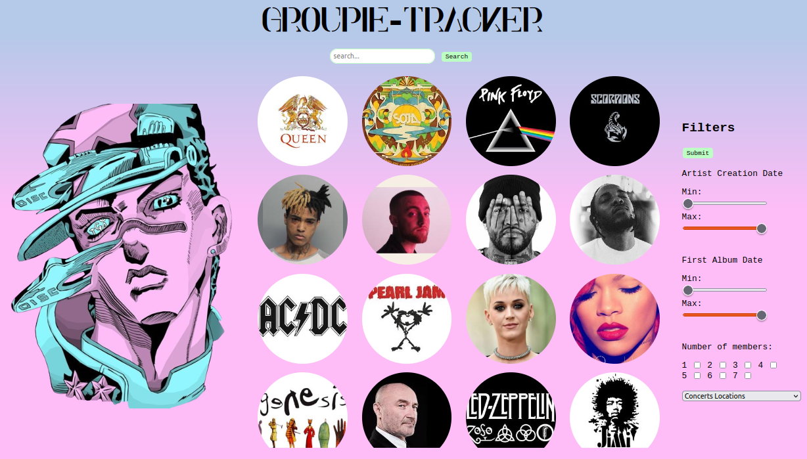

# Groupie-Tracker

Groupie-Tracker is a project written in Golang aimed at receiving a given [API](https://groupietrackers.herokuapp.com/api) and manipulating the contained data to create a website displaying the information. The provided APIs contain music group names, along with their albums, artists, creation dates, first album dates, and concert dates.
<p align="center">
  
</p>

## Features

- Display a list of music groups on the homepage.
- Click on a group's image to navigate to its dedicated page displaying detailed information such as first album, creation dates, etc.
- Search functionality allows users to search for groups, artists, album names, and concert venues.
- Filters enable users to refine the list of displayed groups on the homepage.
- Styled with CSS inspired by JoJo's Bizarre Adventure.

## Installation

To run Groupie-Tracker locally, follow these steps:

1. Clone this repository to your local machine.
   ```
   git clone https://github.com/yourusername/groupie-tracker.git
   ```
2. Navigate to the project directory.
   ```
   cd groupie-tracker
   ```
3. Build the project.
   ```
   go build cmd/main.go
   ```
4. Run the executable.
   ```
   ./groupie-tracker
   ```
5. if you don't want build, you could run the project.
   ```
   go run cmd/main.go
   ```
6. Access the application in your web browser at `http://localhost:8080` or click in your terminal on the link

## Usage

Upon running Groupie-Tracker, you can access the homepage where a list of music groups is displayed. You can click on any group's image to view detailed information about that group on a separate page. The search bar allows you to search for specific groups, artists, albums, or concert venues. Additionally, filters are available to narrow down the displayed groups based on certain criteria.

## Dependencies

Groupie-Tracker relies on the following dependencies:

- [Gorilla Mux](https://github.com/gorilla/mux): A powerful HTTP router and URL matcher for building Go web servers.
- [Your Favorite JSON Parsing Library]: Used for parsing the JSON data received from the API.
- [CSS Framework]: CSS framework used to implement the JoJo's Bizarre Adventure-inspired styling.

## Contributing

Contributions to Groupie-Tracker are welcome! If you have any ideas for new features, improvements, or bug fixes, feel free to open an issue or submit a pull request.

## Co-developers

- Delestre Thomas
- Fouquemberg Axelle
- Lovergne Raphael